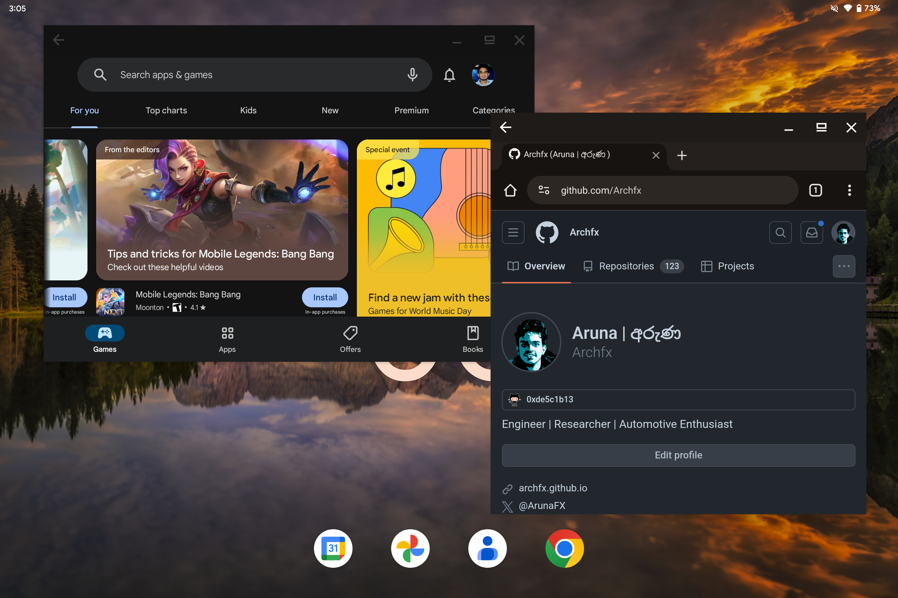
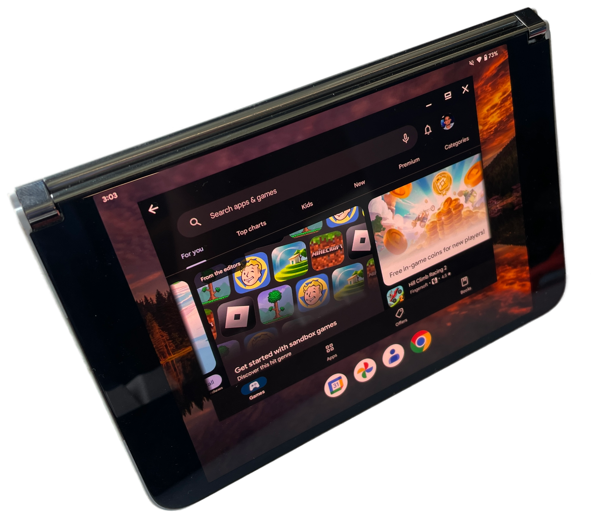
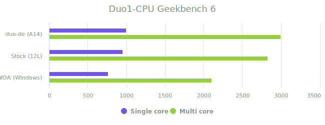
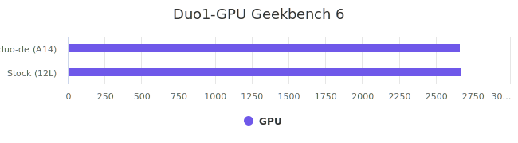

# duo-de <sup><sup>[surface-duo desktop experience]</sup></sup>


This is a GSI variant ROM build targetted for Microsoft Surface Duo with the intention of using the Surface Duo as a desktop environment using experimental floating window features. This build combines gapps/vanila variants of the GSI ROM from [ponces](https://github.com/ponces/treble_aosp) with desktop mode enabled + various tweaks to make it nice and smooth with the help of [thain](https://github.com/thai-ng) tweaks. All credits go to respective developers. Desktop mode can be disabled from the ``home settings``, if required. The latest version is stable and secure for daily usage.

Before you start please read [this announcement](https://github.com/Archfx/duo-de/discussions/52) regarding this project.


<p align="center">
 </p>

## Posture Engine

With the posture processor engine, both duo1 and duo2 react to various postures. Specifically, the touch configurations and display settings will toggle between left-screen phone mode, right-screen phone mode, and tablet mode based on the hinge position. The hinge gaps can be enabled/disabled through the treble app.
<p align="center">
 
 </p>

## Benchmarks

These results are just for reference (for people who enjoy numbers) to compare the CPU and GPU performance of this ROM (latest build) with other operating system options. Best case numbers of each operating system are included in the graphs.

<div style="text-align: center;">
  
| Comparison | duo-de Results |
|-------|------|
|  | [duo-de cpu](https://browser.geekbench.com/v6/cpu/7437614) |
|  | [duo-de gpu](https://browser.geekbench.com/v6/compute/2640466) |

</div>


## Flashing steps
**Try this at your own risk and proceed with caution!**

Following are the steps to flash this image to your surface duo.

1. Download the release. 
```shell
wget https://github.com/Archfx/duo-de/releases/download/[[version]]/aosp-arm64-ab-gapps-14.0-[[version]].img.xz
```
2. Extract the compressed `*.xz` file to obtain the `*.img`. (Windows users can use something like 7-zip, Linux and Mac users can use either of following commands with respective commandline utilities).
```shell
tar -xf aosp-arm64-ab-gapps-14.0-[[version]].img.xz #tar utility
```
```shell
gunzip aosp-arm64-ab-gapps-14.0-[[version]].img.xz #gunzip utility
```
3. If you are migrating from Android 12L (stock) follow this step. You need to unlock the bootloader before proceeding. Please pay attention to commands, do not copy and execute the commands blindly.
```shell
adb reboot fastboot
fastboot delete-logical-partition system_ext
fastboot delete-logical-partition product

#get the current slot
fastboot getvar current-slot
# if current slot is a, delete the system_b
fastboot delete-logical-partition system_b
# if current slot is b, delete the system_a
fastboot delete-logical-partition system_a

fastboot flash system aosp-arm64-ab-gapps-14.0-[[version]].img
fastboot reboot 
```
4. Migrating from 13/14 pixel experience, follow the below steps 
```shell
adb reboot fastboot
fastboot flash system aosp-arm64-ab-gapps-14.0-[[version]].img
fastboot reboot 
```
5. Perform a manual reboot once the device is booted to the home screen so that first-time configurations are applied.
6. Once you flash a **duo-de** version using the above steps, subsequent updates will be received using OTA. You can check updates using ``settings -> system -> system updates``.

## FAQ
- I flashed the ROM, however, the windows are not floating even if the desktop mode is enabled.
> In this situation please enable the following settings from the developer options.
> - Force activities to be resizable
> - Enable freeform windows
> - Enable non-resizable in multi-window
>   
> This issue is fixed in subsequent releases after `v2024.07.09`

## Issues
Any issues, please 
[open an issue](https://github.com/Archfx/duo-de/issues/new/choose) with a detailed description. Please use the [discussion](https://github.com/Archfx/duo-de/discussions/new/choose) section for any questions regarding flashing and similar stuff.

## Credits
These people have helped this project in some way or another, so they should be the ones who receive all the credit:

[phhusson](https://github.com/phhusson) [AndyYan](https://github.com/AndyCGYan) [eremitein](https://github.com/eremitein) [kdrag0n](https://github.com/kdrag0n) [Peter Cai](https://github.com/PeterCxy) [haridhayal11](https://github.com/haridhayal11) [sooti](https://github.com/sooti) [Iceows](https://github.com/Iceows) [ChonDoit](https://github.com/ChonDoit) [ponces](https://github.com/ponces) [thai-ng](https://github.com/thai-ng) [Axel](https://github.com/axel358)


## Disclaimer
THIS REPOSITORY CONTAINS A CUSTOM ANDROID GENERIC SYSTEM IMAGE (GSI) ROM PROVIDED "AS IS," WITHOUT WARRANTY OF ANY KIND. USE, DOWNLOAD, OR INSTALLATION OF THIS SOFTWARE IS AT YOUR OWN RISK. THE AUTHORS ARE NOT LIABLE FOR ANY DAMAGES, INCLUDING BUT NOT LIMITED TO DEVICE DAMAGE, DATA LOSS, OR OTHER ISSUES RESULTING FROM THE USE OR INSTALLATION OF THIS ROM. INSTALLING CUSTOM ROMS MAY VOID YOUR DEVICE'S WARRANTY AND COULD BRICK YOUR DEVICE, RENDERING IT UNUSABLE. VERIFY COMPATIBILITY WITH YOUR DEVICE BEFORE INSTALLATION. NO GUARANTEE OF UPDATES, FIXES, OR SUPPORT IS PROVIDED. THIRD-PARTY SOFTWARE INCLUDED IS SUBJECT TO ITS OWN TERMS. MODIFICATION AND REDISTRIBUTION ARE PERMITTED UNDER THE PROVIDED LICENSE, BUT AUTHORS DISCLAIM LIABILITY FOR ISSUES ARISING FROM SUCH ACTIONS. BY PROCEEDING, YOU ACCEPT THESE TERMS. IF YOU DO NOT AGREE, DO NOT USE THIS SOFTWARE. 


