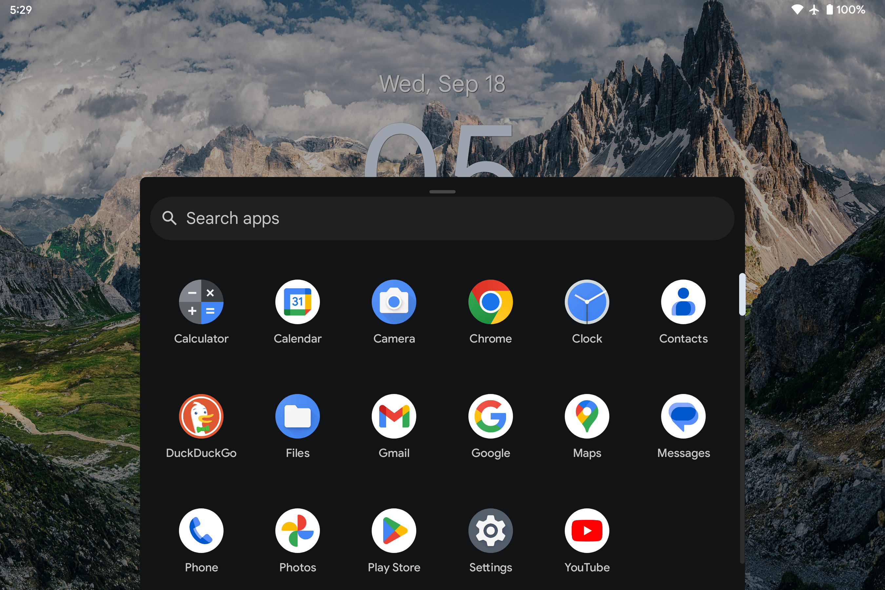
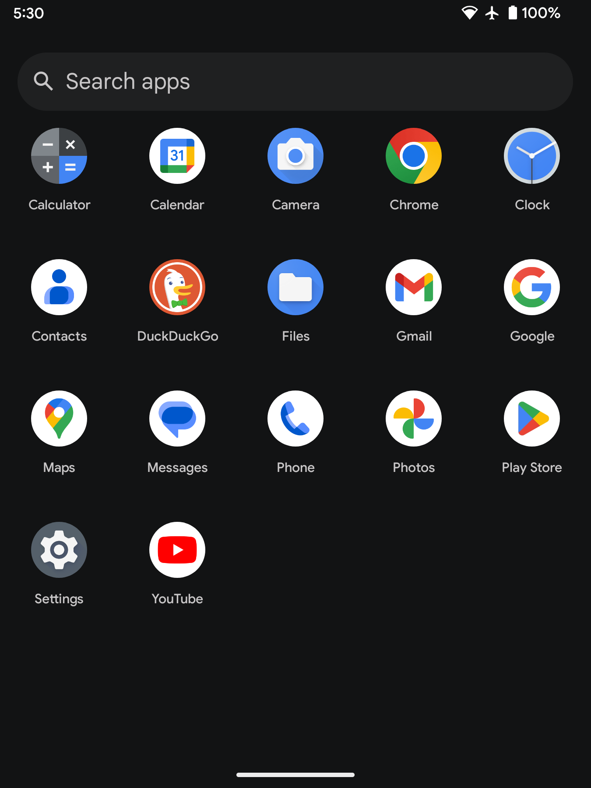
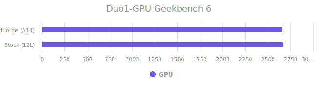

# Surface-duo Dual Experience [duo-de][A15]


The Surface Duo, Microsoft's dual-screen Android device, aimed to redefine mobile productivity by offering a unique form factor that combined the versatility of two screens with the familiarity of the Android operating system. Although Microsoft officially ceased updates and support for the Surface Duo line in early 2023, with AOSP GSI and the help of the open-source community, it is time to give a second life to this awesome and unique hardware.

DUO-DE is a GSI variant Android ROM created for Microsoft Surface Duo devices, offering a clean AOSP experience. This build combines gapps/vanila variants of the GSI ROM from [ponces](https://github.com/ponces/treble_aosp) with desktop mode enabled + various tweaks to make it nice and smooth with the help of [thain](https://github.com/thai-ng) tweaks. All credits go to respective developers. The latest version is stable and secure for daily usage.
Before you proceed, please take a moment to read [this announcement](https://github.com/Archfx/duo-de/discussions/52) regarding this project. By using this ROM, you are agreeing to the [`DISCLAIMER`](#disclaimer).


<p align="center">
 </p>

## Posture Engine and Dual Modes

With the posture processor engine, both duo1 and duo2 react to various postures. Specifically, the touch configurations and display settings will toggle between left-screen phone mode, right-screen phone mode, and tablet mode based on the hinge position. The hinge gaps can be enabled/disabled through the treble app.
<p align="center">
 
 </p>

This ROM switches between tablet mode (first image) and phone mode (second image) when you change the postures. These modes are optimized (both visually and utility-wise) for each of the situations and the screen's real state. 

<p align="center">
 
 </p>

> Note: In case your device does not react to tent or ramp mode (landscaped phone mode) by default, you have to enable it from the `Home settings`. When you are in Phone mode, click and hold on the desktop, click `Home settings` on the popup menu, and enable the `Allow home screen rotation` feature. This will enable the launcher to serve the Tent mode and Ramp modes.

### Floating Windows
Floating windowed mode can be enabled/disabled for tablet mode and phone mode separately. To do that, click and hold the desktop, click `Home settings`, and find the settings `Tablet Mode Floating Windows` and `Phone Mode Floating Windows`. 

### Split Windows
You can still launch apps in split window mode (similar to the Stock 12L) using two methods, 

1. Click and hold the application icon, and click the option `Split Screen` from the popup menu
2. Launch the apps first, and use the gesture (or recent apps button on the navigation bar) to access the recent apps window and click `Split`.

Both options will prompt you to open the second application to share the screen.

## Benchmarks

These results are just for reference (for people who enjoy numbers) to compare the CPU and GPU performance of this ROM (latest build) with other operating system options. The best-case numbers of each operating system are included in the graphs.

<div style="text-align: center;">
  
| Comparison | duo-de Results |
|-------|------|
|  | [duo-de cpu](https://browser.geekbench.com/v6/cpu/7437614) |
|  | [duo-de gpu](https://browser.geekbench.com/v6/compute/2640466) |

</div>


## Flashing steps
**Try this at your own risk and proceed with caution!**

Following are the steps to flash this image to your surface duo.

1. Download the release. 
```shell
wget https://github.com/Archfx/duo-de/releases/download/[[version]]/aosp-arm64-ab-gapps-15.0-[[version]].img.xz
```
2. Extract the compressed `*.xz` file to obtain the `*.img`. (Windows users can use something like 7-zip, Linux and Mac users can use either of following commands with respective commandline utilities).
```shell
tar -xf aosp-arm64-ab-gapps-15.0-[[version]].img.xz #tar utility
```
```shell
gunzip aosp-arm64-ab-gapps-15.0-[[version]].img.xz #gunzip utility
```
3. If you are migrating from Android 12L (stock) follow this step. You need to unlock the bootloader before proceeding. Please pay attention to commands, do not copy and execute the commands blindly.
```shell
adb reboot fastboot
fastboot delete-logical-partition system_ext
fastboot delete-logical-partition product

#get the current slot
fastboot getvar current-slot
# if current slot is a, delete the system_b
fastboot delete-logical-partition system_b
# if current slot is b, delete the system_a
fastboot delete-logical-partition system_a

fastboot flash system aosp-arm64-ab-gapps-15.0-[[version]].img
fastboot reboot 
```
4. Migrating from 13/14 pixel experience, follow the below steps 
```shell
adb reboot fastboot
fastboot flash system aosp-arm64-ab-gapps-15.0-[[version]].img
fastboot reboot 
```
5. Enable the following settings from the developer options and perform a manual reboot.  
> - Force activities to be resizable
> - Enable freeform windows
> - Enable non-resizable in multi-window

6. Once you flash a **duo-de** version using the above steps, subsequent updates will be received using OTA. You can check updates using ``settings -> system -> system updates``.

7. If you wish to see future updates and feature improvements, consider _starring_ (★) the project—it motivates the development of new releases!


## Issues
Any issues, please 
[open an issue](https://github.com/Archfx/duo-de/issues/new/choose) with a detailed description. Please use the [discussion](https://github.com/Archfx/duo-de/discussions/new/choose) section for any questions regarding flashing and similar stuff.

## Credits
These people have helped this project in some way or another, so they should be the ones who receive all the credit:

[phhusson](https://github.com/phhusson) [AndyYan](https://github.com/AndyCGYan) [eremitein](https://github.com/eremitein) [kdrag0n](https://github.com/kdrag0n) [Peter Cai](https://github.com/PeterCxy) [haridhayal11](https://github.com/haridhayal11) [sooti](https://github.com/sooti) [Iceows](https://github.com/Iceows) [ChonDoit](https://github.com/ChonDoit) [ponces](https://github.com/ponces) [thai-ng](https://github.com/thai-ng) [farmerbb](https://github.com/farmerbb)


## Disclaimer
THIS REPOSITORY CONTAINS A CUSTOM ANDROID GENERIC SYSTEM IMAGE (GSI) ROM PROVIDED "AS IS," WITHOUT WARRANTY OF ANY KIND. USE, DOWNLOAD, OR INSTALLATION OF THIS SOFTWARE IS **AT YOUR OWN RISK**. THE AUTHORS ARE **NOT LIABLE** FOR ANY DAMAGES, INCLUDING BUT NOT LIMITED TO DEVICE DAMAGE, DATA LOSS, OR OTHER ISSUES RESULTING FROM THE USE OR INSTALLATION OF THIS ROM. INSTALLING CUSTOM ROMS MAY VOID YOUR DEVICE'S WARRANTY AND COULD BRICK YOUR DEVICE, RENDERING IT UNUSABLE. VERIFY COMPATIBILITY WITH YOUR DEVICE BEFORE INSTALLATION. **NO GUARANTEE OF UPDATES, FIXES, OR SUPPORT IS PROVIDED**. THIRD-PARTY SOFTWARE INCLUDED IS SUBJECT TO ITS OWN TERMS. MODIFICATION AND REDISTRIBUTION ARE PERMITTED UNDER THE PROVIDED LICENSE, BUT AUTHORS **DISCLAIM LIABILITY** FOR ISSUES ARISING FROM SUCH ACTIONS. **BY PROCEEDING, YOU ACCEPT THESE TERMS. IF YOU DO NOT AGREE, DO NOT USE THIS FIRMWARE IMAGE.** 


